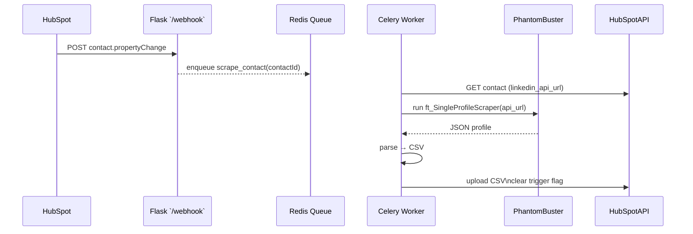

# LinkedIn Profile Scraper Automation

Automates enrichment of HubSpot contacts with fresh LinkedIn profile data by  
listening to a **LinkedIn Scraper Trigger** property, running a PhantomBuster
scraper, then attaching the resulting CSV back to the contact.

---

## Key Features

- **Webhook-driven**: 0 idle polling, sub-second start-up.
- **Queue-based**: handles many simultaneous triggers, processed FIFO.
- **Stateless dyno**: Flask only receives webhooks; all heavy work runs in Celery workers.
- **Single-click deploy** on **Heroku** (free Eco tier fine for dev).
- **Extensible**: drop-in Redis/Celery auto-scaling when volume grows.

---

## High-Level Architecture



⸻

## Project Structure

```

root/
├── app.py                # Flask webhook endpoint + health check
├── tasks.py              # Celery app & async task definitions
├── linkedin.py           # PhantomBuster client wrapper
├── hubspot/
│   ├── client.py         # thin HubSpot API wrapper
│   └── utils.py          # signature verification, helpers
├── utils/
│   └── csv_helpers.py    # JSON→CSV converter, tmp file manager
├── requirements.txt
├── Procfile              # Heroku dyno declarations
├── runtime.txt           # Heroku Python runtime pin
└── README.md             # you’re reading it

Why so small?
Polling, scheduler and extra beat dynos are gone; Redis is only required if you turn on Celery workers (recommended for > 1 concurrent trigger).
```

⸻

## Tech Stack

Layer Tool Notes
Webhook API Flask tiny footprint
Async jobs Celery (+Redis) optional for concurrency
Queue / Cache Redis set REDIS_URL
Scraper PhantomBuster ft_Single LinkedIn Profile Scraper
CRM HubSpot Contact trigger ↔ file upload
Hosting Heroku free Eco dynos OK

⸻

## Setup & Running Locally

    1.	Clone

git clone https://github.com/<you>/linkedin-scraper-automation.git
cd linkedin-scraper-automation

    2.	Python env

pyenv virtualenv 3.11 scraper-env
pyenv activate scraper-env
pip install -r requirements.txt

    3.	Env vars (.env)

FLASK_ENV=development
HUBSPOT_APP_SECRET=**_
HUBSPOT_API_TOKEN=_**
PHANTOMBUSTER_API_KEY=\*\*\*
REDIS_URL=redis://localhost:6379/0 # optional

    4.	Run

# webhook receiver

python app.py

# worker (only if using Celery locally)

celery -A tasks worker --loglevel=info

⸻

## Deploying to Heroku

heroku create linkedin-scraper-automation
heroku addons:create heroku-redis:hobby-dev # optional
heroku config:set $(cat .env | xargs) # push secrets
git push heroku main

Procfile

web: python app.py
worker: celery -A tasks worker --concurrency=4 --loglevel=info

(Omit the worker: line if you choose a single-threaded Flask-only version.)

⸻

## Webhook Endpoint /webhook

Concern Implementation
Validation Verify X-HubSpot-Signature-v4 HMAC.
Subscription check Echo hub.challenge on GET requests.
Deduplication Store event ID or (contactId, ts) in Redis for 24 h.
Timeout budget Reply 200 < 5 s; enqueue job immediately.

⸻

## Scaling & Concurrency

    •	Queue length metric → Heroku autoscale worker dynos.
    •	Each Celery task is I/O heavy (HubSpot + PhantomBuster); 4 workers per tiny dyno suffices.
    •	For now tasks execute serially if you skip Redis/Celery; add them when triggers > 1 /min.

⸻

## Building Blocks to Implement

    •	hubspot/client.py
    •	get_contact(contact_id) → returns linkedin_api_url
    •	upload_file(contact_id, csv_path)
    •	clear_trigger(contact_id)
    •	linkedin.py
    •	run_scraper(api_url) → returns JSON profile
    •	utils/csv_helpers.py
    •	json_to_csv(profile_json, columns) → temp file path
    •	tasks.py
    •	scrape_contact.delay(contact_id) orchestrates the whole flow
    •	app.py
    •	minimal Flask app exposing /webhook and /healthz

⸻

## Roadmap / Future Ideas

    •	Retry logic on Phantom errors → Celery exponential back-off.
    •	Bulk mode: group ≤ 10 contacts per scraper run to cut Phantom calls.
    •	Status dashboard: push task state to a Slack channel.
    •	Error monitoring: Sentry or Honeybadger integration..add -A
